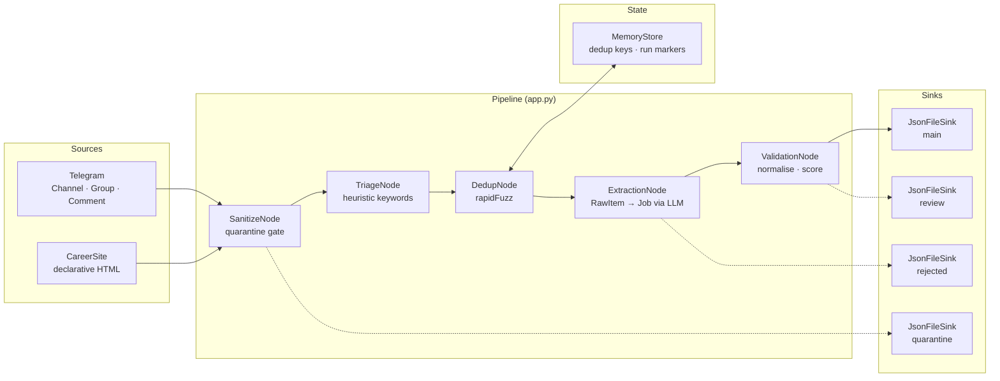
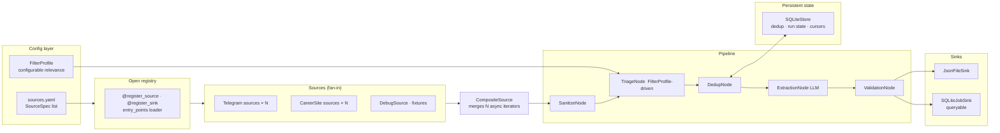
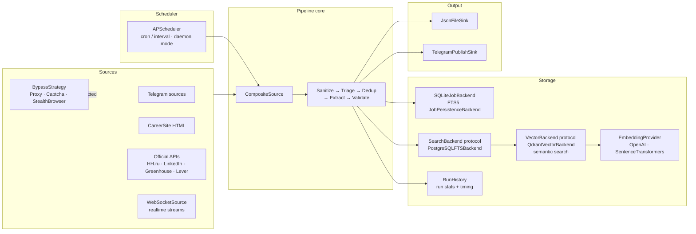
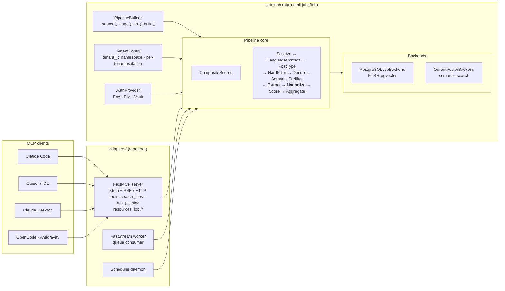
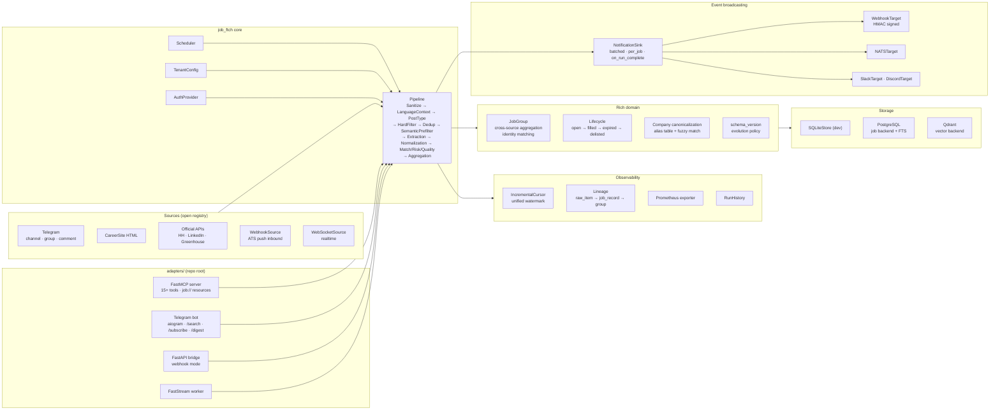
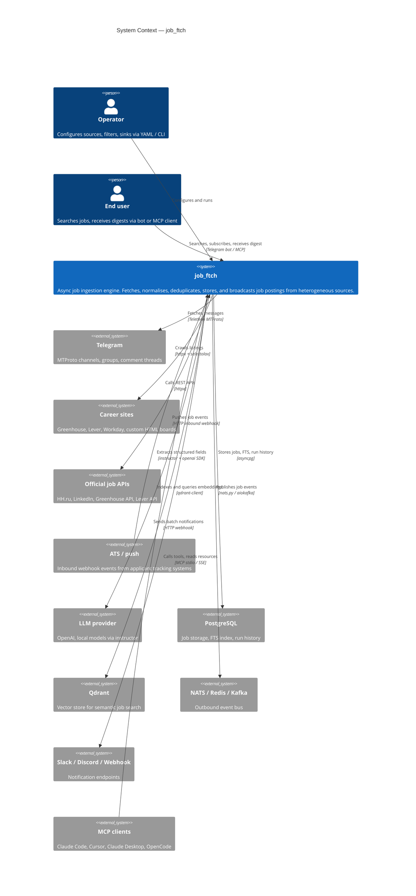
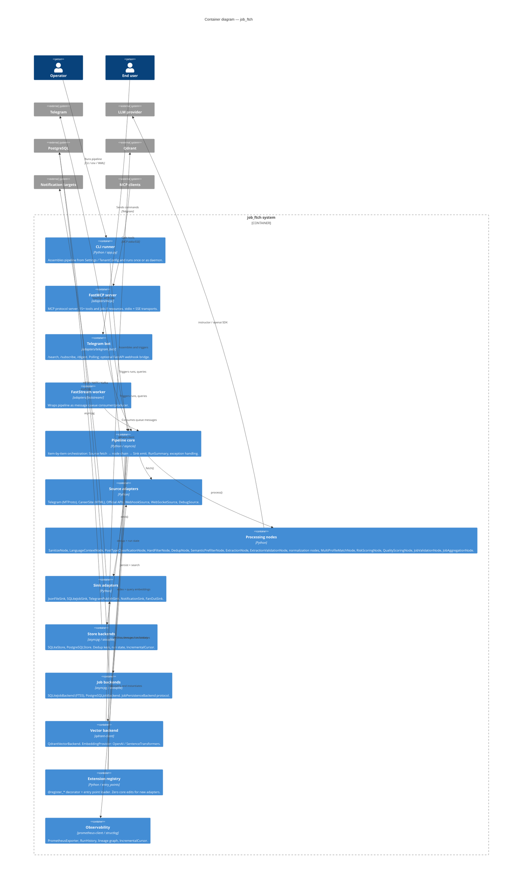
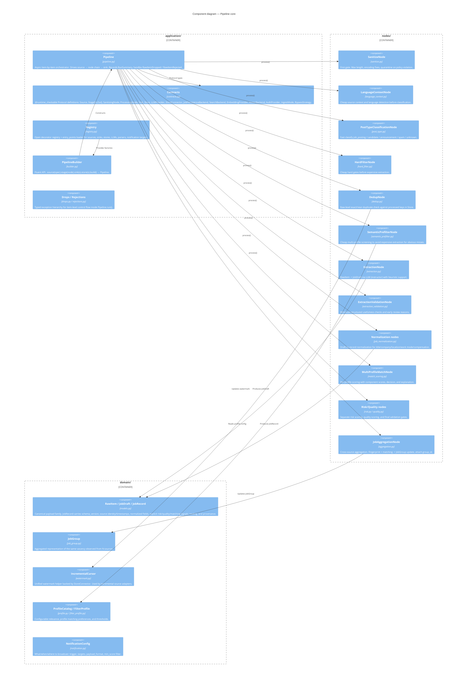

# job_ftch


**job_ftch** is a library-first async ingestion engine for job postings. It fetches from heterogeneous sources (Telegram channels/groups, career sites, official APIs, ATS webhooks), moves data through the canonical payload family `RawItem -> JobDraft -> JobRecord -> JobGroup`, and emits normalized records to pluggable sinks — decoupled from any runtime orchestrator. Any wrapper (CLI, FastStream, FastAPI, Dagster, Airflow, MCP server, Telegram bot) is an adapter on top, not part of the core.

---

### Core Concept & Entities
**job_ftch** ingests jobs from Telegram, career sites, and APIs, then normalizes, deduplicates, and scores them against candidate profiles. The final vacancies are delivered via a Telegram bot, MCP server, or CLI.

| Entity | Description | Docs |
| :--- | :--- | :--- |
| **RawItem** | Unprocessed data from source (HTML, Telegram message). | [entities/RawItem](docs/entities/README.md) |
| **JobDraft** | Extracted but not yet normalized job data. | [entities/JobDraft](docs/entities/README.md) |
| **JobRecord** | Fully normalized and scored job record. | [entities/JobRecord](docs/entities/README.md) |
| **JobGroup** | Canonical job aggregated across multiple sources. | [entities/JobGroup](docs/entities/README.md) |
| **SourceSpec** | Declarative configuration for a job source. | [entities/SourceSpec](docs/entities/README.md) |
| **FilterProfile** | Matching criteria (keywords, relevance) for a tenant. | [entities/FilterProfile](docs/entities/README.md) |
| **RunSummary** | Statistics and outcome of a single pipeline run. | [entities/RunSummary](docs/entities/README.md) |
| **RuntimeAdapter**| Wrapper for specific runtimes (Bot, MCP, FastAPI). | [entities/RuntimeAdapter](docs/entities/README.md) |

---

## Support status of source types

Support status of source types. Stable = production-ready, Experimental = works but less battle-tested, Planned = spec exists, not production.

| Source type | Status |
|---|---|
| `telegram_channel` / `telegram_group` / `telegram_comments` | Stable |
| `career_site` / `declarative_html` (DOM + ATS monitors) | Stable |
| `rss_feed` | Stable |
| `local_fixture` | Stable (dev/testing) |
| Official APIs: `rest_api`, `greenhouse`, `hh`, `lever`, `superjob` | Experimental |
| `browser` / `hard_scraper` | Experimental (community-maintained) |
| `telegram_realtime` | Experimental |
| `webhook` / `websocket` (push/realtime) | Planned |

---

## Tenant CLI surface

With `--configs-dir` pointing at tenant configs, the operator-facing CLI already exposes the core runtime surface:

```bash
python app.py --configs-dir config/tenants tenants list
python app.py --configs-dir config/tenants tenants status ai_jobs
python app.py --configs-dir config/tenants tenants run ai_jobs
python app.py --configs-dir config/tenants tenants lineage ai_jobs <job_id>
python app.py --configs-dir config/tenants runs list --tenant ai_jobs --limit 20
python app.py --configs-dir config/tenants runs show <run_id> --tenant ai_jobs
```

`tenants lineage` returns the current `JobLineage` payload for one persisted job, including
the originating `raw_item_id`, `group_id`, `pipeline_stages`, and `source_run_id`.
`runs list/show` exposes persisted `RunSummary` history keyed by `source_run_id`.

---

## Evolutionary architecture

> NOTE: This is the TARGET architecture (roadmap), not the current implemented state.
> See the Support Matrix above for what ships today.

The system grows through 5 qualitative milestones. Each slide shows the horizontal component layout and key responsibilities at that point.

Milestones 1-4 are historical snapshots of earlier phases. They intentionally use the stage names and payload assumptions of their time. The current target shape is described by Milestone 5 and the live document in `docs/architecture.md`.

### Milestone 1 — Phase 10: Linear MVP pipeline (historical snapshot, shipped)

Two sources, one LLM extraction stage, in-memory dedup, JSON output.



---

### Milestone 2 — Phase 13: Multi-source + open registry + persistent store (historical snapshot)

Declarative `sources.yaml`, `@register_source` open registry, `SQLiteStore` survives restarts, `FilterProfile` replaces hardcoded keywords.



---

### Milestone 3 — Phase 17: Search + scheduler + API adapters + bypass (historical snapshot)

Full-text and vector search, periodic scheduling, official job API sources, pluggable bypass strategies for protected sites.



---

### Milestone 4 — Phase 22: Packaged library + multi-tenant + MCP server (historical snapshot)

All code under `job_ftch/` package, `PipelineBuilder` fluent API, `TenantConfig` isolation, FastMCP server exposes tools and resources to Claude Code, Cursor, and other MCP clients.



---

### Milestone 5 — Phase 27: Full platform (target roadmap state, partially landed)

Rich domain (lifecycle, canonicalization, schema versioning), cross-source aggregation, observability, and configurable event broadcasting.
This slide is the target architecture. Parts of it are already in the codebase; other pieces
such as Prometheus export and broader observability hardening remain
roadmap work tracked in `docs/roadmap.md`.



---

## Architecture — C4 (full roadmap state)

### Level 1: System Context



---

### Level 2: Containers



---

### Level 3: Pipeline core components



---

## Quick Start

```bash
git clone https://github.com/<OWNER>/job_ftch
cd job_ftch
uv sync
```

Run with fixture data (no credentials required):

```bash
uv run python app.py \
  --source-path fixtures/e2e/multisource_positive.jsonl \
  --output-path artifacts/debug/jobs.json \
  --max-items 20
```

### Run the Telegram bot (Docker)

1. Fill runtime values in `.env.dev` and `adapters/telegram_bot/.env.dev`.
2. Launch the monolith MVP (core + bot in one container) with `Postgres + Qdrant`:
```bash
docker compose up -d --build
```
3. Follow bot logs:
```bash
docker compose logs -f bot
```
See `adapters/telegram_bot/` for details.

### Manual runs via CLI

```bash
uv run python scripts/evaluate_extraction.py \
  --fixture fixtures/extraction/gold_samples.jsonl \
  --llm-backend heuristic
```

Outputs:
- `artifacts/debug/jobs.json` — main jobs
- `artifacts/debug/review.jsonl` — borderline items for operator review
- `artifacts/debug/rejected.jsonl` — dropped items with reasons
- `artifacts/debug/quarantine.jsonl` — items blocked at sanitize gate

---

## Documentation

| Topic | File |
|---|---|
| Architecture (detailed C4 + principles) | [docs/architecture.md](docs/architecture.md) |
| Tech stack | [docs/tech_stack.md](docs/tech_stack.md) |
| Dev rules | [docs/rules.md](docs/rules.md) |
| Roadmap | [docs/roadmap.md](docs/roadmap.md) |
| Configuration reference | [docs/configuration.md](docs/configuration.md) |
| Source setup | [docs/source_setup.md](docs/source_setup.md) |
| Examples | [docs/examples.md](docs/examples.md) |
| Troubleshooting | [docs/troubleshooting.md](docs/troubleshooting.md) |
| Release checklist | [docs/release_checklist.md](docs/release_checklist.md) |
| ADRs | [docs/adr/](docs/adr/) |

## Contributing

See [CONTRIBUTING.md](CONTRIBUTING.md).

## License

MIT
