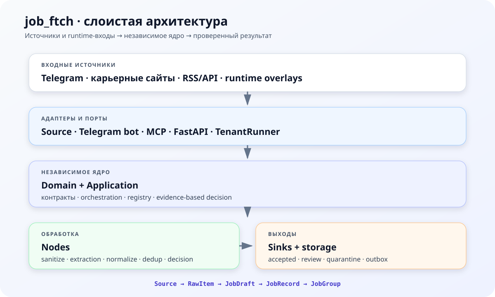

# job_ftch


[Documentation](https://letya999.github.io/job_ftch/) · [Telegram vacancy feed](https://t.me/ai_engineer_jobs) · [AI Engineers Guild](https://t.me/ai_engineers_guild) · [GitHub](https://github.com/letya999/job_ftch)

**An async, library-first pipeline for collecting, filtering, and publishing structured job vacancies.**

`job_ftch` collects signals from Telegram, career sites, RSS, APIs, and runtime sources. It normalizes them into typed records, removes duplicates, evaluates relevance, and publishes accepted or reviewable results.

```text
Source → RawItem → JobDraft → JobRecord → JobGroup → Sink
```

## Features

- Telegram, career-site, RSS, API, and local-fixture inputs.
- Typed pipeline stages with explicit contracts.
- Deduplication, profile matching, relevance scoring, and evidence-based decisions.
- Multi-tenant runtime with source overlays and isolated state.
- CLI, Telegram bot, MCP, FastAPI, FastStream, and Dagster adapters.

## Architecture



The core is split into independent layers:

| Layer | Responsibility |
| --- | --- |
| `domain/` | Models, value objects, and contracts |
| `application/` | Ports, registries, orchestration, and runtime composition |
| `nodes/` | Sanitation, extraction, normalization, scoring, and decision stages |
| `infrastructure/` | Sources, stores, LLMs, embeddings, browsers, and observability |
| `adapters/` | External runtime entry points such as Telegram, MCP, and FastAPI |
| `sinks/` | Files, review, quarantine, and delivery outputs |

The detailed pipeline and layer rules are documented in [`docs/architecture.md`](docs/architecture.md).

## Quick start

```bash
git clone https://github.com/letya999/job_ftch.git
cd job_ftch
uv sync
```

Run the local classification fixture:

```bash
uv run job_ftch eval --fixture classification
```

Run a tenant from a YAML configuration:

```bash
uv run job_ftch run --config tenant.yaml
```

See the [quickstart guide](docs/quickstart.md) for a complete local example.

## Common commands

```bash
uv run job_ftch validate --config tenant.yaml
uv run job_ftch run --config tenant.yaml
uv run job_ftch eval --fixture classification
uv run job_ftch tenants list
uv run job_ftch runs list
```

## Input support

| Input | Status |
| --- | --- |
| Telegram channels, groups, and comments | Stable |
| Career sites | Stable |
| RSS feeds and local fixtures | Stable |
| REST and job-board APIs | Experimental |
| Webhooks, WebSockets, and standalone browser source | Adapter-oriented or stub |

## Documentation

- [Vision](docs/vision.md)
- [Architecture](docs/architecture.md)
- [Quickstart](docs/quickstart.md)
- [Source setup](docs/sources/setup.md)
- [Production recipe](docs/recipes/pipeline_recipe.md)
- [Runtime and environment](docs/adapters/runtime_and_env.md)
- [Quality gates and CI](docs/operations/ci-cd.md)

## License

MIT. See [LICENSE](LICENSE).
