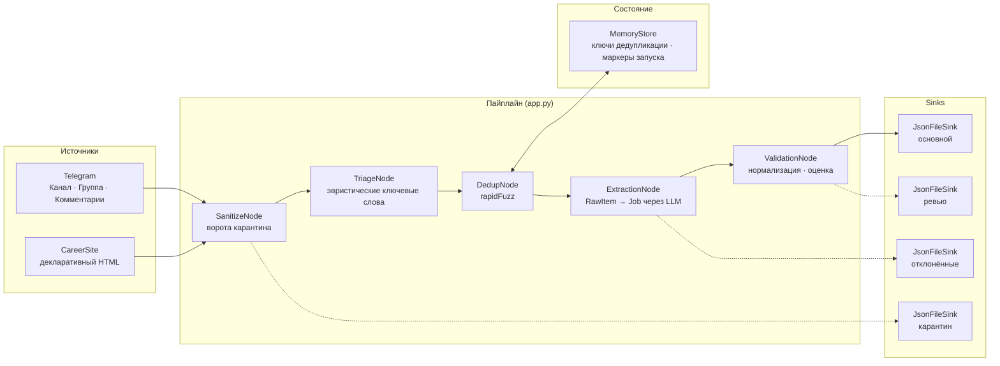
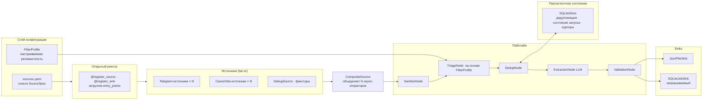
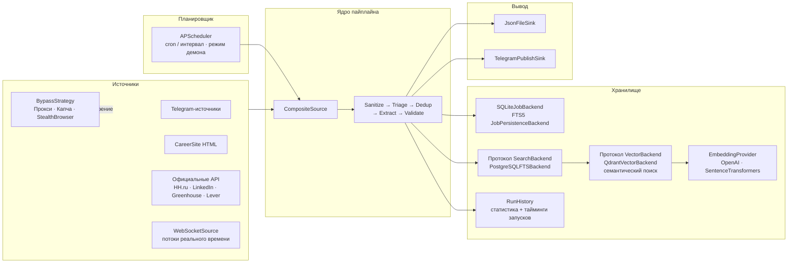
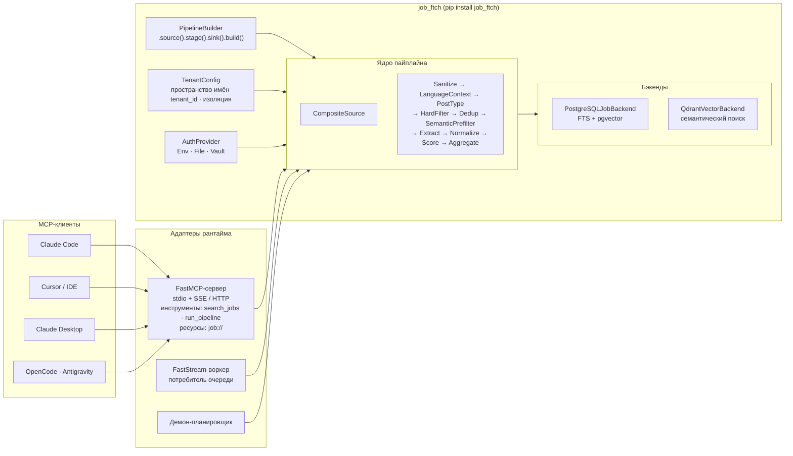
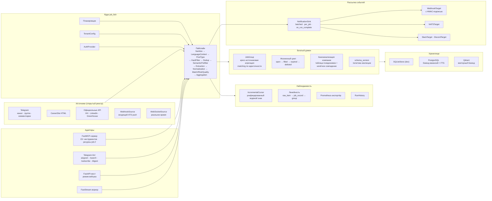
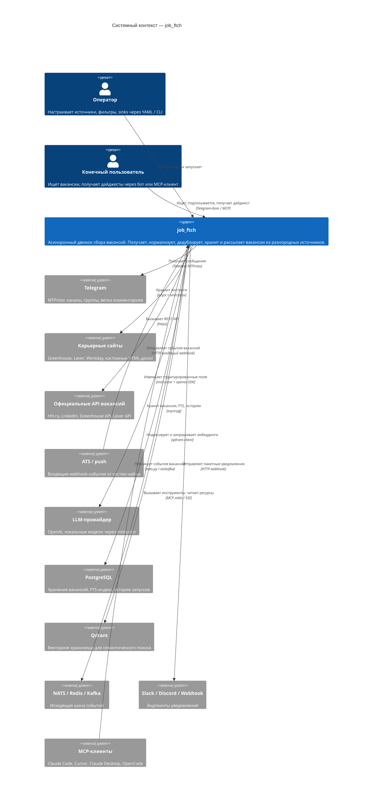
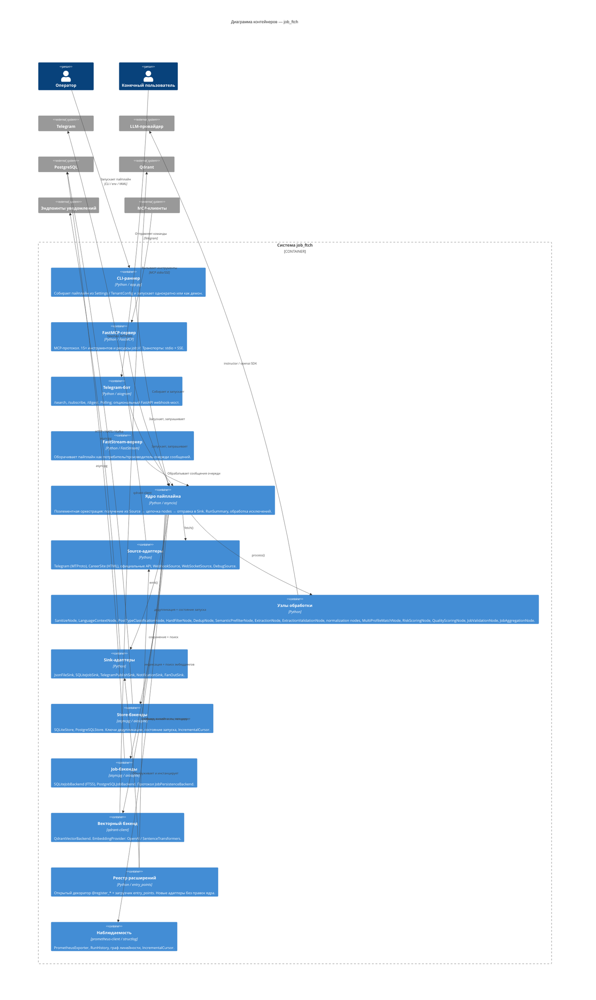
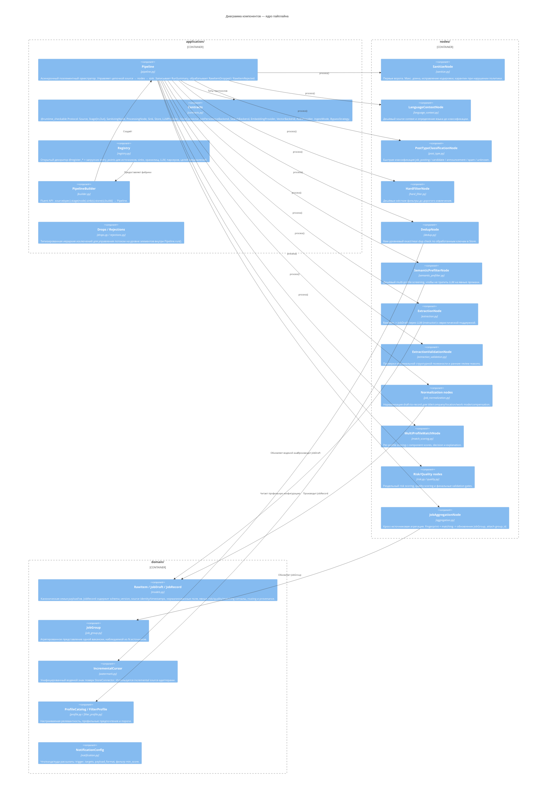

# job_ftch


**job_ftch** — library-first асинхронный движок для сбора вакансий. Собирает данные из разнородных источников (Telegram-каналы/группы, карьерные сайты, официальные API, ATS-вебхуки), проводит их через каноническую семью payload'ов `RawItem -> JobDraft -> JobRecord -> JobGroup` и отправляет нормализованные записи в подключаемые sinks — без привязки к конкретному оркестратору. Любая обёртка (CLI, FastStream, FastAPI, Dagster, Airflow, MCP-сервер, Telegram-бот) — это адаптер поверх ядра, а не часть ядра.

---

## Статус поддержки типов источников

Статус поддержки типов источников. Stable = готово к эксплуатации, Experimental = работает, но менее проверено, Planned = есть спецификация, не для продакшена.

| Тип источника | Статус |
|---|---|
| `telegram_channel` / `telegram_group` / `telegram_comments` | Stable |
| `career_site` / `declarative_html` (DOM + ATS monitors) | Stable |
| `rss_feed` | Stable |
| `local_fixture` | Stable (dev/testing) |
| Официальные API: `rest_api`, `greenhouse`, `hh`, `lever`, `superjob` | Experimental |
| `browser` / `hard_scraper` | Experimental (поддерживается сообществом) |
| `telegram_realtime` | Experimental |
| `webhook` / `websocket` (push/realtime) | Planned |

---

## Tenant CLI surface

Если `--configs-dir` указывает на каталог tenant-конфигов, операторский CLI уже открывает
основной runtime surface:

```bash
python app.py --configs-dir config/tenants tenants list
python app.py --configs-dir config/tenants tenants status ai_jobs
python app.py --configs-dir config/tenants tenants run ai_jobs
python app.py --configs-dir config/tenants tenants lineage ai_jobs <job_id>
python app.py --configs-dir config/tenants runs list --tenant ai_jobs --limit 20
python app.py --configs-dir config/tenants runs show <run_id> --tenant ai_jobs
```

`tenants lineage` возвращает текущий payload `JobLineage` для одной сохранённой вакансии:
там есть исходный `raw_item_id`, `group_id`, `pipeline_stages` и `source_run_id`.
`runs list/show` открывает сохранённую историю `RunSummary`, привязанную к `source_run_id`.

---

## Эволюция архитектуры

> ПРИМЕЧАНИЕ: Это ЦЕЛЕВАЯ архитектура (roadmap), а не текущее состояние реализации.
> Актуальный статус см. в Таблице поддержки выше.

Система растёт через 5 качественных переходов. Каждый слайд показывает горизонтальный состав компонентов и их ключевые обязанности на данном этапе.

Переходы 1-4 — это исторические снимки более ранних фаз. Они намеренно используют названия этапов и payload'ов своего времени. Актуальная целевая форма описана в переходе 5 и в живых документах `docs/architecture.md` и `JOB_FTCH_MASTER_PLAN.md`.

### Переход 1 — Фаза 10: Линейный MVP-пайплайн (исторический снимок, сдан)

Два источника, один этап LLM-извлечения, дедупликация в памяти, вывод в JSON.



---

### Переход 2 — Фаза 13: Мультиисточники + открытый реестр + персистентное хранилище (исторический снимок)

Декларативный `sources.yaml`, открытый реестр `@register_source`, `SQLiteStore` переживает перезапуск, `FilterProfile` заменяет захардкоженные ключевые слова.



---

### Переход 3 — Фаза 17: Поиск + планировщик + API-адаптеры + обход защиты (исторический снимок)

Полнотекстовый и векторный поиск, периодическое планирование, официальные API вакансий, подключаемые стратегии обхода защищённых сайтов.



---

### Переход 4 — Фаза 22: Пакетированная библиотека + мультитенантность + MCP-сервер (исторический снимок)

Весь код под пакетом `job_ftch/`, fluent API `PipelineBuilder`, изоляция `TenantConfig`, FastMCP-сервер предоставляет инструменты и ресурсы Claude Code, Cursor и другим MCP-клиентам.



---

### Переход 5 — Фаза 27: Полная платформа (целевое состояние роадмапа, реализовано частично)

Богатая доменная модель (жизненный цикл, каноникализация, версионирование схемы), кросс-источниковая агрегация, наблюдаемость и настраиваемая рассылка событий.
Этот слайд описывает целевую архитектуру. Часть её уже есть в коде, а такие куски как
Prometheus-экспорт и более широкий observability hardening
по-прежнему остаются задачами roadmap из `docs/roadmap.md`.



---

## Архитектура — C4 (финальное состояние роадмапа)

### Уровень 1: Системный контекст



---

### Уровень 2: Контейнеры



---

### Уровень 3: Компоненты ядра пайплайна



---

## Быстрый старт

```bash
git clone https://github.com/[owner]/job_ftch
cd job_ftch
uv sync
cp .env.example .env
```

Запуск с тестовыми данными (учётные данные не требуются):

```bash
uv run python app.py \
  --source-path fixtures/e2e/multisource_positive.jsonl \
  --output-path artifacts/debug/jobs.json \
  --max-items 20
```

Запуск на Telegram-канале:

```bash
uv run python app.py \
  --source-backend telegram_channel \
  --telegram-entity ai_jobs \
  --max-items 100
```

Запуск на карьерном сайте:

```bash
uv run python app.py \
  --source-backend career_site \
  --career-site-url https://job-boards.greenhouse.io/clickhouse
```

Оффлайн-оценка качества извлечения:

```bash
uv run python scripts/evaluate_extraction.py \
  --fixture fixtures/extraction/gold_samples.jsonl \
  --llm-backend heuristic
```

Результаты:
- `artifacts/debug/jobs.json` — основные вакансии
- `artifacts/debug/review.jsonl` — пограничные элементы для ревью оператора
- `artifacts/debug/rejected.jsonl` — отклонённые элементы с причинами
- `artifacts/debug/quarantine.jsonl` — заблокированные на этапе санитизации

---

## Документация

| Тема | Файл |
|---|---|
| Архитектура (подробные C4 + принципы) | [docs/architecture.md](docs/architecture.md) |
| Технологический стек | [docs/tech_stack.md](docs/tech_stack.md) |
| Правила разработки | [docs/rules.md](docs/rules.md) |
| Роадмап | [docs/roadmap.md](docs/roadmap.md) |
| Справочник конфигурации | [docs/configuration.md](docs/configuration.md) |
| Настройка источников | [docs/source_setup.md](docs/source_setup.md) |
| Примеры | [docs/examples.md](docs/examples.md) |
| Устранение неполадок | [docs/troubleshooting.md](docs/troubleshooting.md) |
| Чеклист релиза | [docs/release_checklist.md](docs/release_checklist.md) |
| ADR (архитектурные решения) | [docs/adr/](docs/adr/) |

## Участие в разработке

См. [CONTRIBUTING.md](CONTRIBUTING.md).

## Лицензия

MIT
