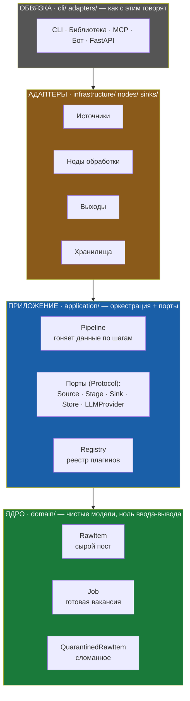
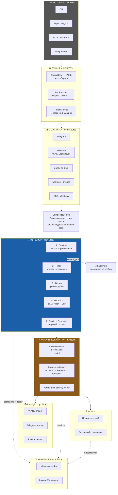
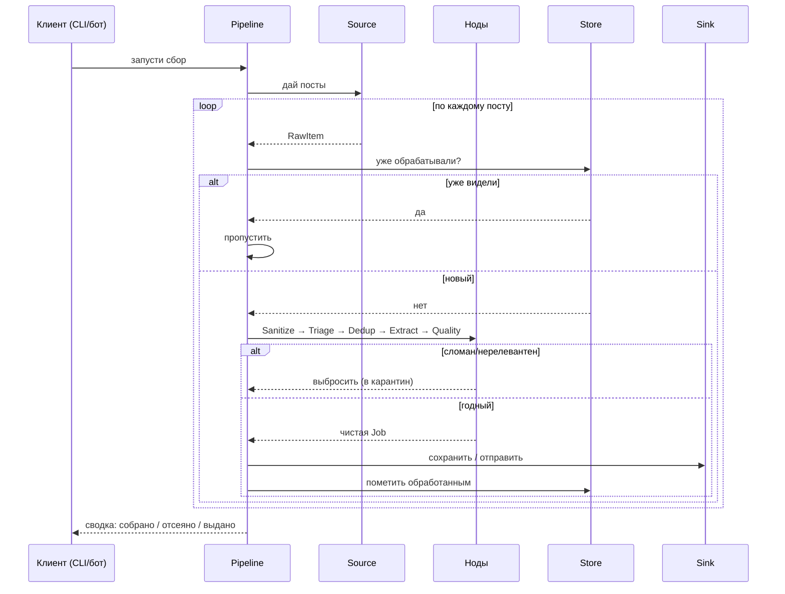
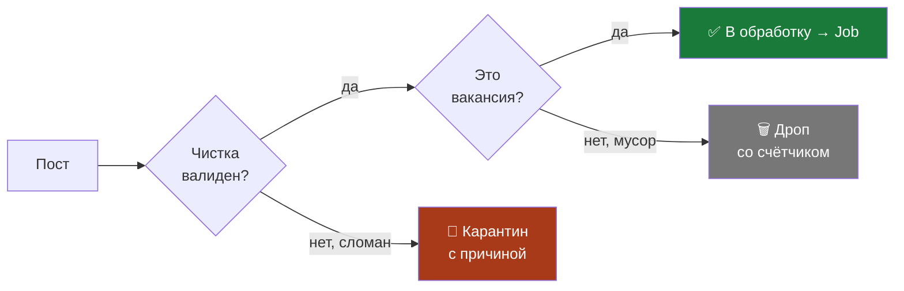

# job_ftch — как это работает

> Лёгкий, расширяемый сервис агрегации вакансий.
> Собирает вакансии из Telegram, карьерных сайтов и API, превращает хаос постов
> в чистые, дедуплицированные, живые вакансии — и отдаёт их куда угодно.

---

## Философия (главное за 1 минуту)

Вся система держится на одной идее: **ядро ничего не знает о внешнем мире.**

Оно не знает, откуда пришли данные (Telegram или сайт), не знает, куда они уйдут
(в файл или в бота), не знает, где хранится состояние (в памяти или в Postgres).
Ядро работает только с **портами** — абстрактными разъёмами.

```
Источник ─▶ [ порт Source ] ─▶ ЯДРО ─▶ [ порт Sink ] ─▶ Выход
                                 │
                            [ порт Store ]
                                 │
                            Хранилище
```

Что это даёт на практике:

| Хочешь | Что делаешь | Трогаешь ядро? |
|--------|-------------|----------------|
| Новый источник (hh.ru, новый сайт) | Пишешь один файл-плагин | ❌ Нет |
| Новый выход (БД, бот, вебхук) | Пишешь один файл-плагин | ❌ Нет |
| Новый шаг обработки | Добавляешь одну ноду | ❌ Нет |
| Сменить хранилище | Меняешь строку в конфиге | ❌ Нет |

**Это и есть "расширяемый".** А "лёгкий" — потому что ядро это ~4600 строк,
которые читаются за вечер. Всё тяжёлое (браузеры, векторные базы, боты) —
опциональные спутники, которые ставятся отдельно и подключаются как плагины.

> Аналогия: **dlt + dbt, но только для вакансий.**
> dlt-часть — вытащить и загрузить данные. dbt-часть — превратить их в чистый,
> версионированный продукт. Только легче и заточено под одну предметную область.

---

## Слои системы

Система делится на слои-кольца. В центре — самое чистое и стабильное.
Чем дальше от центра — тем больше "грязи" реального мира.



**Правило золотого центра:** стрелки зависимостей всегда смотрят внутрь.
Обвязка зависит от адаптеров, адаптеры от приложения, приложение от домена.
Домен не зависит ни от чего. Поэтому его невозможно сломать снаружи.

---

## Полная картина: как всё собирается после роадмапа

Это путь одной вакансии — сверху вниз.



---

## Что происходит за один запуск (по шагам)



**Ключевая деталь — идемпотентность.** У каждого поста есть отпечаток
(`stable_id` = хэш источника и ID). Запустишь сбор хоть 100 раз — дубликатов
не будет, система просто пропустит уже виденное. Это значит: можно запускать
по расписанию без страха засорить вывод.

---

## Два потока: годное и сломанное

Важная философская деталь: **ничего не теряется молча.**



- **Годное** идёт дальше и становится `Job`.
- **Сломанное** (битый URL, пустой текст) уходит в **карантин** с пометкой
  "почему" — чтобы потом посмотреть и починить источник.
- **Мусор** (не вакансия) дропается, но **считается** — видно, сколько и почему.

Поэтому оператор всегда видит честную воронку:
`собрано → почищено → отсеяно → выдано`. Никаких чёрных дыр.

---

## Итог одной фразой

**Маленькое неизменное ядро в центре, вокруг — кольца сменных плагинов.**
Добавить источник, выход или шаг = воткнуть деталь, а не чинить мотор.
Поэтому система остаётся лёгкой, но растёт бесконечно.
